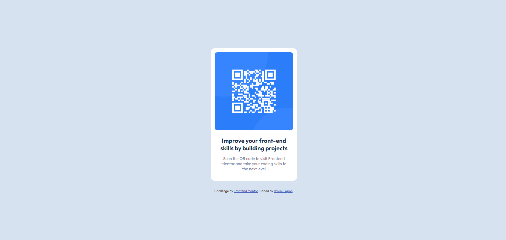

# Frontend Mentor - QR code component solution

This is a solution to the [QR code component challenge on Frontend Mentor](https://www.frontendmentor.io/challenges/qr-code-component-iux_sIO_H). Frontend Mentor challenges help you improve your coding skills by building realistic projects. 

## Table of contents

- [Overview](#overview)
  - [Screenshot](#screenshot)
  - [Links](#links)
- [My process](#my-process)
  - [Built with](#built-with)
  - [What I learned](#what-i-learned)
  - [Continued development](#continued-development)
- [Author](#author)

## Overview

### Screenshot

### Links

- Solution URL: (https://github.com/rakibulapon46/frontend-mentor/tree/main/qr-code)
- Live Site URL: (https://rakibulapon46.github.io/qr-code/)

## My process

### Built with

- Semantic HTML5 markup
- CSS custom properties
- Flexbox
- Mobile responsive

## Author

- Github - [rakibulapon46](https://github.com/rakibulapon46)
- Frontend Mentor - [@rakibulapon46](https://www.frontendmentor.io/profile/rakibulapon46)
- Facebook - [@rakibul.apon79](https://www.facebook.com/rakibul.apon79)
